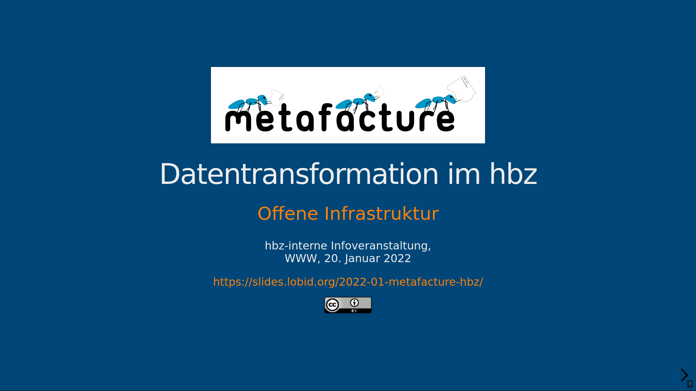

Last Thursday, [hbz's Open Infrastructure team](https://lobid.org/team) presented (in German) Metafacture and its current development at an hbz-internal info event. We talked about the tool, its history and its functionality. We also showed use cases and new Metafacture developments currently being worked on. The slides can be found at [https://slides.lobid.org/2022-01-metafacture-hbz/](https://slides.lobid.org/2022-01-metafacture-hbz/).

This talk provided a first glimpse into the power of Metafacture and will be followed up  with a hands-on workshop with all hbz-colleagues interested in using Metafacture in the future.