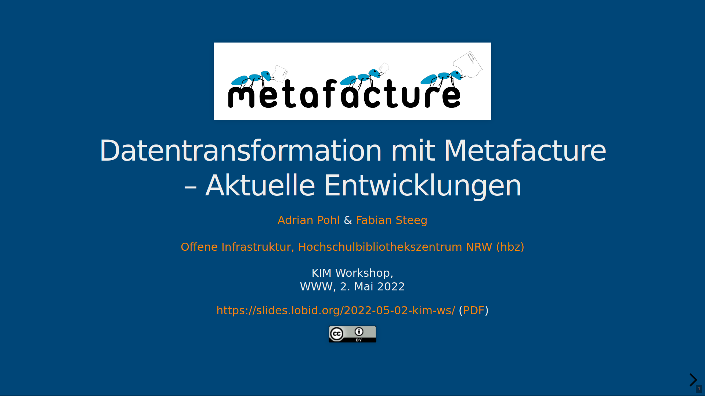

Last week, Adrian and Fabian of hbz's Open Infrastrutcure team presented the ongoing Metafacture developments (Fix, Playground) at the annual workshop of the German-speaking DINI AG KIM (Competence Center for Interoperable Metadata). The slides in German can be found at [https://slides.lobid.org/2022-05-02-kim-ws/](https://slides.lobid.org/2022-05-02-kim-ws/). The talk sparked some interest, especially the outlook to develop some best practices for providing an ETL hub, where people can search for data transformation processes they might reuse in their own work.

Our thanks go to the KIM workshop organizers who created a great programme. Especially, the new event types went over really well: For one, the interactive session where people could present and discuss their tools and workflows for structuring, planning and distribute their daily work, see the [notes from the session](https://pad.gwdg.de/s/p-ZKuYh_D) (German). Secondly, there was the Hacky Morning where people got together in groups to try out and become familiar with the OpenAlex Open API ([main note pad](https://pad.gwdg.de/s/10A5KGGCI)). It was really fun and provided a great way to spark a community feeling which gets lost too easily when meeting online in COVID-19 times instead of having an in-person meeting. 

As always, it was very nice to meet up with other metadata nerds at a KIM workshop.